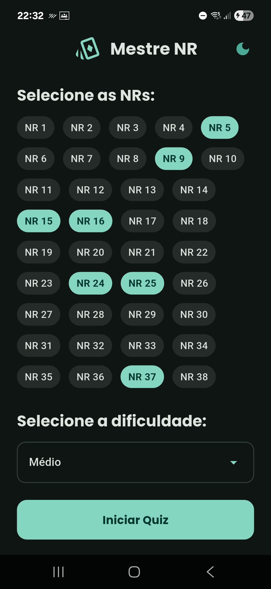
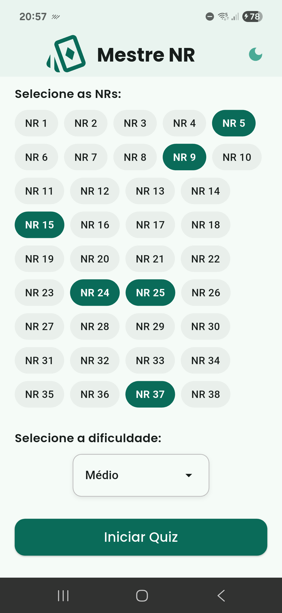
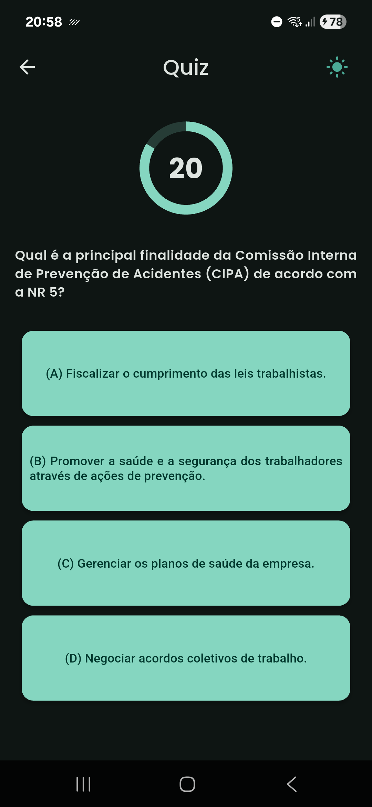
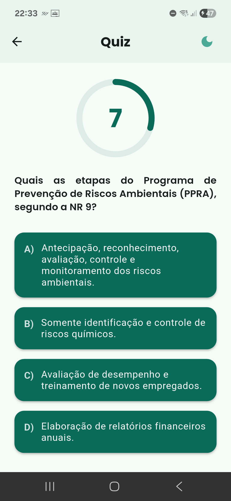
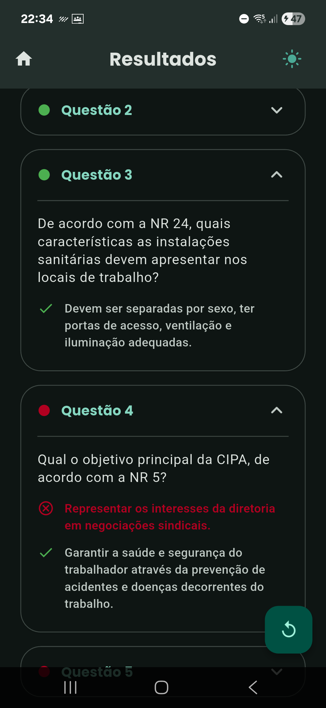
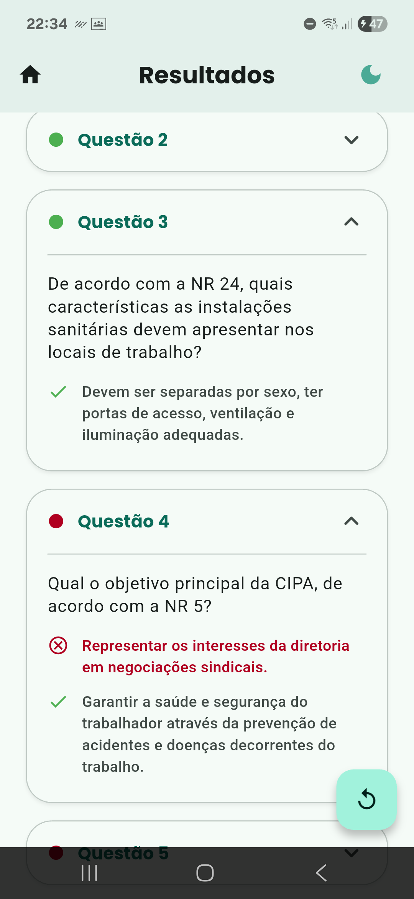

<h1>
  
  Mestre NR
</h1>

A simple and engaging quiz game built with Flutter, featuring questions on Workplace Hygiene and Safety in accordance with Brazil's Normas Regulamentadoras(NR's). The project integrates Firebase AI Logic to dynamically manage content and enhance the quiz experience. Designed as a lightweight, mobile-friendly app for learning and quick assessments.

# 🧩 Previews and Features

## Home Screen
<p align="center">
  
  
</p>

## Quiz Screen
<p align="center">
  
  
</p>

## Summary Screen
<p align="center">
  
  
</p>

# 🧰 Toolbox

<p align="center">
  <a href="https://skillicons.dev">
    
  </a>
</p>
<br/>

# 🚀 How to Run
<p>To run this project, you need to have Flutter installed and configured on your machine and an account with Firebase Console</p>

## 1. Clone the repository

```
 git clone https://github.com/VorAd2/mestre-nr-quiz
 cd mestre-nr-quiz
```

## 2. Create a Firebase project and install Firebase SDK
- <a href='https://console.firebase.google.com'> Firebase Console </a>
- <a href='https://firebase.google.com/docs/ai-logic'> Firebase SDK and Firebase AI tutorial </a>

## 3. Install dependencies

```
flutter pub get
```

## 4. Run !!
Here are two useful links teaching you how to run a Flutter app on mobile devices:
- <a href='https://youtu.be/yxif9Tj8fDE?si=H1UAFWMO05MYUVre'> Physical device </a>
- <a href='https://docs.flutter.dev/platform-integration/android/setup'> Virtual device </a>
